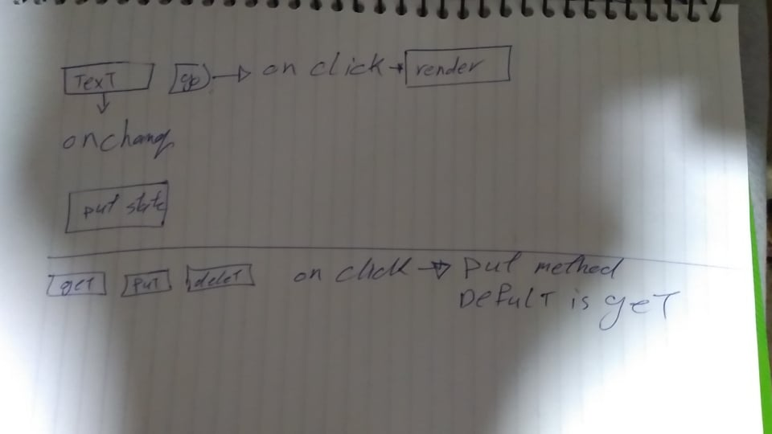

# LAB - Class 26

## Project: RESTy

### Author: ahmad kma

### Links and Resources

- [submission PR](http://xyz.com)
<!-- 
- [ci/cd](http://xyz.com) (GitHub Actions)
- [back-end server url](http://xyz.com) (when applicable) -->
- [front-end application](https://musing-booth-a3b47c.netlify.app/
) 

### Setup

#### `.env` requirements (where applicable)

- `PORT` - 3000

#### How to initialize/run your application (where applicable)

- e.g. `npm start`

#### How to use your library (where applicable)

#### Tests

- no test

#### UML

